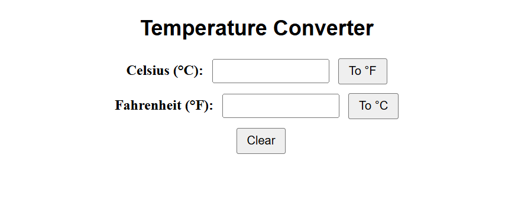

# 🌡️ Temperature Converter - Angular App

This is a Angular app that allows users to convert temperatures between **Celsius** and **Fahrenheit**.

---

## 🚀 Features

- ✅ Convert **Celsius to Fahrenheit**
- ✅ Convert **Fahrenheit to Celsius**
- ✅ Clear both inputs with one click

---

## 🛠️ Tech Stack

- Angular
- TypeScript
- HTML, CSS
- FormsModule (for ngModel binding)

---

## 📸 Screenshot



---

## ▶️ How to Run Locally

```bash
# 1. Clone this repo
git clone https://github.com/YOUR_USERNAME/temperature-converter.git

# 2. Navigate into the project folder
cd temperature-converter

# 3. Install dependencies
npm install

# 4. Run the Angular dev server
ng serve

# 5. Then open your browser and go to:
http://localhost:4200

